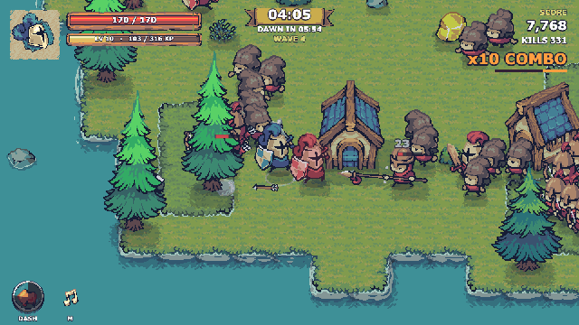

# Tiny Swords: Last Stand

**Play it in your browser: https://theenigmathatisme.github.io/tiny_swords/**



A browser arena-survival game built on Pixel Frog's **Tiny Swords** free art pack.
Hold a small island against an escalating horde for ten minutes, chain sword swings through crowds, dash out of lancer charges, level up and pick upgrades. Vanilla Canvas 2D, no framework, no runtime dependencies.

**Highlights:** fixed-timestep loop with pooled entities and zero per-step allocation · seeded island generator with autotiling, baked shadows and shore foam · Dijkstra flow-field pathing for hundreds of enemies · every sound synthesized with the Web Audio API, including an intensity-driven music loop · a zero-dependency headless play-test harness that drives Chrome over the DevTools Protocol.

## Run it

Either of these works:

```
npm run dev          # zero-dependency static server -> http://127.0.0.1:8080/
```

or just open `index.html` in Chrome, Firefox or Safari (everything loads from relative paths, no modules). The game loads a single packed sprite atlas (`assets/atlas-0.png`, about 0.7 MB) plus the scripts.

Other commands:

```
npm test             # headless play-test: bot plays a full run in Chrome, reports errors/fps, writes screenshots
npm run test:file    # same, but opens index.html via file:// instead of the dev server
python3 tools/build_atlas.py # rebuild assets/atlas-0.png + src/atlas-data.js from the art pack (needs Pillow and the pack, see Licence)
```

URL flags: `?fps=1` shows the FPS counter from the start, `?bot=1` lets the built-in bot play (also disables auto-pause; used by the play-test).

## Deploy to GitHub Pages

The game is plain static files with relative paths, so it runs unchanged from a Pages subpath such as `https://<user>.github.io/tiny_swords/`. A `.nojekyll` file is checked in so Pages serves the asset folder verbatim.

0. Make sure the art pack is not in the git history (it never should be; this repo's history was rewritten before going public).
1. The repository must be public (GitHub Free only builds Pages from public repos): `gh repo edit --visibility public --accept-visibility-change-consequences`.
2. Enable Pages from the main branch root: `gh api -X POST repos/<user>/tiny_swords/pages -f build_type=legacy -f "source[branch]=main" -f "source[path]=/"` (or Settings > Pages > Deploy from a branch > main / root).
3. Wait a minute for the first build, then open `https://<user>.github.io/tiny_swords/`. Every later push to main redeploys automatically.

## Controls

| Action | Keys |
| --- | --- |
| Move | WASD or arrow keys |
| Aim | Mouse (keyboard-only: aims along your movement direction) |
| Attack / chain | Left click or Space (hold to keep chaining) |
| Dash (invulnerable, passes through enemies) | Shift or right click |
| Pick an upgrade | 1 / 2 / 3 or click a card |
| Pause / resume | Esc or P (Q on the pause screen quits to the title); music pauses with the game |
| Restart after a run | R or Enter |
| Mute / FPS counter | M / F |

Controls are also listed on the start screen and the pause screen.

## Design rationale

**Genre: arcade arena survival ("survivors-like") with direct melee combat.** The free pack's strongest, most complete assets are its animated unit sheets: five factions, each with a Warrior that has a two-swing combo and a guard pose, a Lancer with directional thrusts and defence stances, an Archer with a shoot animation and arrow, a Monk with a heal plus heal effect, and Pawns, alongside explosion/dust/splash effects, a 64px grass autotile set with animated shore foam, and 9-slice UI bars, ribbons, papers and buttons. There is no path or road art, no economy UI and no audio, so a tower defence or RTS would have needed lots of invented systems the art does not support, while a horde arena needs exactly what is here: one readable hero, several enemy types with telegraphed animations, hit effects and a pretty island to fight on.

The core loop: **every ten seconds** you are weaving through Pawns and Warriors, timing swings so one arc catches a clump, dashing sideways out of a Lancer's red charge line and then punishing its stagger for double damage. **Every minute** a surge wave lands on one shore, a new enemy type is introduced (Warriors at 1:00, Archers at 2:00, Lancers at 3:30, Monks at 5:00, black elite variants from 6:00 and the Warlord boss at 8:00), and a level-up hands you three upgrade cards that push the build toward wide sweeping arcs, fast chains, lifesteal tankiness or dash mobility. **"One more run"** comes from the fixed finish line (survive until dawn at 10:00), the local best score, the combo multiplier that rewards hitting groups, and wanting to see whether a different upgrade path can hold the Lancer waves.

## What is in the game

- Start screen, run, fail state (Fallen) and win state (Dawn Breaks), restart with R without reloading.
- One polished mechanic: the sword. A two-hit combo aimed at the mouse, chainable while holding attack, with an optional 360° Whirlwind on every third swing. Hits apply hit-stop, screen shake, white flash, knockback, sparks, floating damage numbers and a slash wedge in the exact aim direction; kills pop coins and an XP burst, crits use the star explosion.
- Five enemy behaviours: Pawn stab, Warrior wind-up slash, Archer kiting and arrows, Lancer telegraphed charge (red path on the ground, with a spear poke when adjacent and chained charges for the boss) and Monk healing (kill them first). Every melee wind-up flashes red just before it lands, and a Lancer that finishes a charge is staggered and takes double damage. Elites are the black faction at 2.6x HP. Enemies navigate with a Dijkstra flow field over the tile grid, recomputed whenever you change tile, so they route around the castle, towers, trees and water instead of pressing against walls; Archers and Lancers only shoot or charge with a clear line of sight, and arrows stick into walls and tree trunks instead of flying through them.
- Difficulty curve: spawn rate, surge size, enemy HP and damage all scale with the clock; enemy roster unlocks over time; boss at 8:00; night falls over the island and dawn breaks at the end.
- Thirteen upgrades with rank caps (damage, attack speed, arc, knockback, speed, max HP, lifesteal, whirlwind, dash, gold, second wind, adrenaline, crit).
- Score with time and combo multipliers, kill counter, run timer and countdown to dawn, boss HP bar, wave announcements, best score in localStorage.
- Synthesized audio (Web Audio): 23 effects plus a procedural music loop whose layers and tempo follow run intensity. No audio files exist in the pack. Impact sounds are aggregated to one per swing (pitched by how many enemies it caught), every effect is rate-gated per name and ducked when it repeats, and sounds farther than a screen away are dropped, so a hundred-enemy horde stays listenable.
- Ambient island: seeded blob island with two grass colours autotiled, animated shore foam, baked shadows, swaying trees and bushes, drifting clouds with shadows, bobbing water rocks, a rubber duck, wandering sheep (hit one for meat, which heals).
- FPS overlay (F) with frame, update and draw milliseconds, entity and draw-call counts.

## Performance notes

Fixed 60 Hz timestep with an accumulator (max 5 steps per frame, then the backlog is dropped), rendering once per animation frame. All entities, particles, effect sprites and floating texts are pooled with swap-remove; the per-step hot path allocates nothing. Enemies use a 96px spatial hash for separation, the flow field is a single Dijkstra pass over about 1,500 tiles with a preallocated binary heap that runs only when the player's tile changes, and the island ground (tiles, patches, shadows) is baked once into an offscreen canvas and blitted with a single draw. Sprites are drawn from a single packed atlas of trimmed frames (generated by `tools/build_atlas.py`) so mostly-transparent 192px frames do not waste fill rate or bandwidth, and everything off-screen is culled. Zoom snaps to half steps so the 2x pixel art stays on an even device-pixel grid.

Measured in headless Chrome (software rendering) by the play-test driver with up to 150 enemies on screen: steady 60 fps, about 1 ms per frame of update plus draw. A real GPU-backed Canvas should be comfortably faster.

## Play-testing

`tools/playtest.mjs` launches headless Chrome through the DevTools Protocol using only Node's built-in `fetch` and `WebSocket`, presses Enter with a real key event, turns on the in-game bot, runs a full ten-minute run at 6x speed with screenshots each game-minute, verifies the R-key restart, and fails on any exception, console error or failed request. On the current tuning the bot, which never learns to kite and only dodges the most obvious threats, dies around minute four, with zero errors logged across the run and restart; a player who dashes through arrows, hunts Archers and Monks, and punishes Lancer staggers goes much further. A second scenario script exercises pause, level-up, boss and victory with real key and mouse events, including a click-through attempt on a freshly opened upgrade popup (ignored for its first 0.45 s) and the music pause flag on the pause and level-up screens. Screenshots land in `playtest-shots/` after `npm test`.

## Known limitations

- Balance has had one human play-through: the first cut was won comfortably (level 23, score 197,300), so the second pass fixed enemy pathing (which had been silently easing the game by stranding enemies behind buildings), steepened late HP and damage scaling, let the alive cap grow from 90 to 140, toughened the Warlord, and cut lifesteal and the combo score multiplier. Expect it to be meaningfully harder now; the knobs are `TS.CFG` and `SFX_GATE` in src/game.js, `ETYPES` and `xpFor` in src/entities.js.
- All sound is synthesized and only checked with a mocked AudioContext plus one human listen; M mutes.
- Keyboard-only play aims along the movement direction, so standing still attacks in the last direction faced.
- No gamepad or touch support; phones are not a target.
- Depth sorting is by feet position, so units standing behind a tall tree trunk are hidden by it. Decorations use circular collision, bushes have none.
- Verified in Chrome (headed and headless). Firefox and Safari should work but were not part of the automated test.
- The play-test driver depends on Google Chrome at its standard macOS path (override with `--chrome=PATH` or `CHROME=`).

## Licence

Code, audio and tooling: MIT, see `LICENSE`. Artwork: **Tiny Swords** by [Pixel Frog](https://pixelfrog-assets.itch.io/tiny-swords), used under its own terms (free for personal and commercial projects; the pack itself may not be redistributed or repackaged). The pack is therefore not in this repository: only a packed atlas of the frames the game draws ships with it, as a build artifact of the game. To rebuild the atlas, download the free pack from itch.io, unzip it to `Tiny Swords (Free Pack)/` at the repo root (gitignored) and run `python3 tools/build_atlas.py`. Full notice in `CREDITS.md`.
